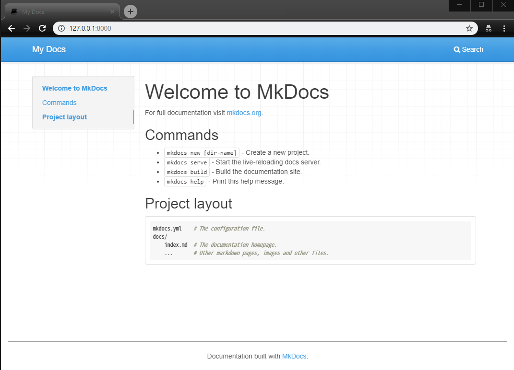
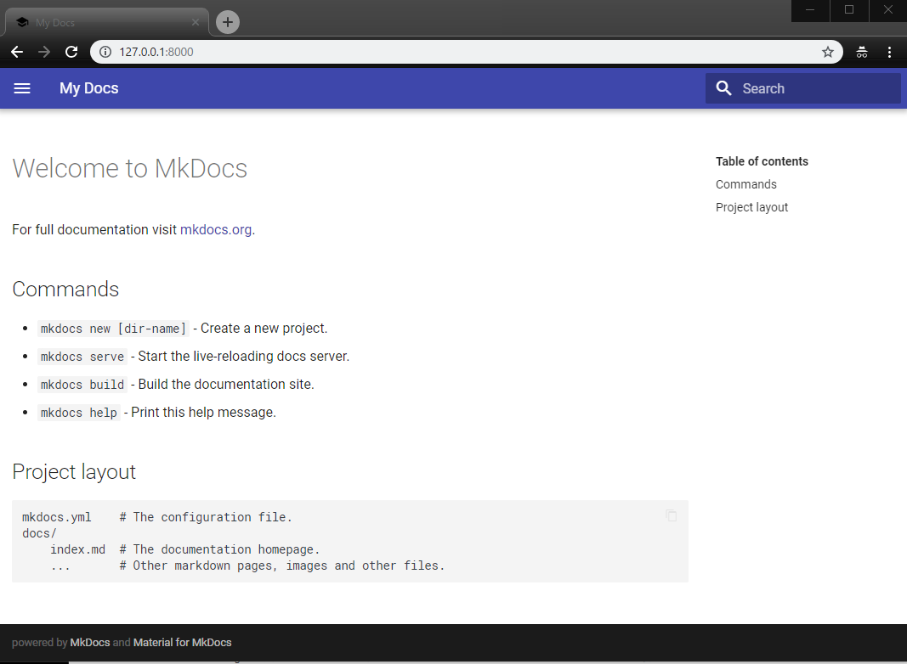

# venv-mkdocs

## Install

```sh
git clone https://github.com/masinc/venv-mkdocs.git
cd venv-mkdocs
python -m venv .
```

Activate venv

```sh
# cd venv-mkdocs

# PowerShell
./Scripts/activate.ps1

# bash
source bin/activate
```

Install package

```sh
pip install -r requirements.txt
```

## Usage

### Activate venv

* PowerShell

    ```PowerShell
    ./Scripts/activate.ps1
    ```

* bash

    ```bash
    source bin/activate
    ```

### Run

```sh
mkdocs new tmpdoc
# INFO    -  Creating project directory: tmpdoc
# INFO    -  Writing config file: tmpdoc\mkdocs.yml
# INFO    -  Writing initial docs: tmpdoc\docs\index.md

cd tmpdoc

mkdocs serve
# INFO    -  Building documentation...
# INFO    -  Cleaning site directory
# [I 190122 12:09:10 server:298] Serving on http://127.0.0.1:8000
# [I 190122 12:09:10 handlers:59] Start watching changes
# [I 190122 12:09:10 handlers:61] Start detecting changes
```

### Change theme to mkdocs-materials (optional)

Add mkdocs.yml

```yml
theme:
  name: 'material'
```

open http://127.0.0.1:8000 in browser

* default theme
    

* material theme

    
